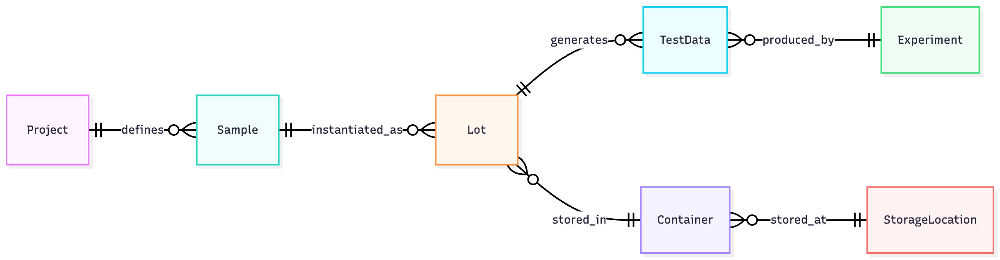

**Project Overview:**
The LIMS Implementation created a unified enterprise scientific data platform supporting assays, samples, materials, and inventory across R&D, Product Development, and Manufacturing. The initiative delivered a scalable and compliant digital foundation with robust data models, governance standards, permission frameworks, and seamless integrations that enabled complete traceability and operational excellence across scientific teams.

## Objectives

1. Implement a modern LIMS platform (Core LIMS) to centralize data, standardize scientific workflows, and support compliance.
2. Design flexible and scalable data models to support assays, samples, materials, and inventory processes.
3. Establish governance frameworks, data integrity controls, and permission models that meet internal and regulatory expectations.
4. Integrate LIMS with major systems including custom applications, DMTA request systems, ERP, and website to support smooth end to end data flow.
5. Enable complete traceability across scientific, operational, and early manufacturing activities.

## Description

I led the full implementation and ownership of the Core LIMS platform. This involved architecting data models, defining governance standards, creating permission structures, and building integrations across the digital ecosystem used by scientific teams. The result was a unified and compliant system that improved data integrity and supported cross functional workflows across the organization.

## Key Highlights

- Designed Core LIMS data models supporting assays, samples, materials, and inventory workflows.
- Created governance standards, permission structures, and data integrity controls that supported regulatory and operational needs.
- Integrated LIMS custom applications, DMTA request systems, ERP, and website tools to ensure smooth and reliable end to end data flow.
- Led alignment across R&D, Product Development, Manufacturing, Operations, Quality, and Informatics to define standardized digital workflows.
- Enabled complete traceability of materials, samples, and scientific data from early research through process development.

## Technology Stack

Core LIMS  
Java  
JavaScript  
REST APIs  
OData  
SQL

## Outcome

The Core LIMS platform became the central digital system supporting scientific operations. It improved data quality, created more traceable workflows, supported compliance requirements, and provided a scalable foundation for future expansion into quality, manufacturing, and advanced analytics. The implementation unified data that had previously been siloed and allowed the organization to operate with greater precision, visibility, and confidence.
