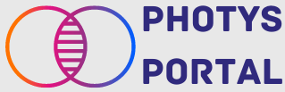

**Project Overview:**  
The Photys Portal is a Django-based scientific data platform designed to streamline how scientists ingest, transform, analyze, and manage experimental data. The application enables users to upload spreadsheets directly from laboratory instruments, automatically join and transform datasets, apply normalization logic, and push curated results into CDD Vault. It also provides bi-directional access to CDD Vault data for downstream analysis, bulk updates, and reporting.

In addition to feature development, the platform was modernized from a VM-based deployment in Azure to a fully serverless architecture on Google Cloud Platform using Cloud Run. The application was secured with Okta authentication, encrypted at rest and in transit, and deployed through a fully automated CI/CD pipeline with enforced unit testing. All application versions and releases were clearly documented and communicated to stakeholders to ensure transparency and adoption.

## Objectives

1. Enable scientists to ingest and transform instrument data with minimal manual effort.
2. Support normalization and data transformations required for CDD Vault ingestion.
3. Provide bi-directional data access between the application and CDD Vault.
4. Enable bulk data updates and efficient data management workflows.
5. Support analytical workloads through integration with BigQuery.
6. Implement a secure, serverless architecture with automated CI/CD and clear version communication.

## Background

Scientific teams relied on spreadsheets generated by laboratory instruments and CDD Vault for compound and assay data management. Manual data preparation and uploads were time-consuming and error-prone. A centralized, secure application was needed to automate data processing, improve data quality, and support both operational and analytical workflows.

## Problem

Instrument-generated data required extensive cleaning, joining, and normalization before it could be uploaded to CDD Vault. Scientists also needed a way to view, transform, and update large volumes of existing CDD Vault data efficiently. The original VM-based deployment increased operational overhead, while inconsistent release communication created uncertainty around feature availability and changes. Strong security controls, repeatable deployments, and clear versioning were required.

## Features

1. **Scientific Data Ingestion & Transformation**
   - Allowed scientists to upload spreadsheets directly from laboratory instruments.
   - Automatically joined datasets and applied transformation and normalization logic.
   - Prepared curated datasets for compliant upload into CDD Vault.

2. **CDD Vault Integration**
   - Enabled viewing of CDD Vault data within the application.
   - Supported transformed data outputs for analysis and reporting.
   - Provided bulk update capabilities to efficiently manage large datasets.

3. **Analytical Data Integration**
   - Integrated with Google BigQuery for large-scale analysis and reporting.
   - Enabled downstream analytics without impacting operational workloads.

4. **Serverless Cloud Modernization**
   - Migrated the application from a VM-based deployment in Azure to GCP Cloud Run.
   - Eliminated server management and improved scalability and reliability.
   - Reduced operational overhead through fully managed infrastructure.

5. **CI/CD Automation**
   - Implemented end-to-end CI/CD using GitHub and Google Cloud Build.
   - Enforced automated unit tests prior to deployment.
   - Enabled consistent, repeatable, and low-risk deployments.

6. **Versioning, Documentation & Communication**
   - Documented all application versions, release notes, and deployment changes.
   - Communicated updates clearly to scientific and technical stakeholders.
   - Ensured users understood new features, fixes, and behavioral changes.

7. **Enterprise Security & Compliance**
   - Integrated Okta for authentication and access control.
   - Ensured encryption of data both at rest and in motion.
   - Aligned the platform with enterprise security and compliance requirements.

8. **Django-Based Architecture**
   - Built using Django to provide a robust, maintainable backend framework.
   - Supported rapid feature development and integration with external systems.

## Technology Stack

- Backend: Django (Python)
- Cloud Platform: Google Cloud Platform (Cloud Run)
- CI/CD: GitHub, Google Cloud Build
- Authentication: Okta
- Data & Analytics: Google BigQuery
- Integrations: CDD Vault APIs
- Security: Encryption at rest and in transit, secure identity management

## Outcome

The Photys Portal significantly improved how scientists managed and analyzed experimental data by automating ingestion, transformation, and integration with CDD Vault. Migrating to a fully serverless Cloud Run architecture reduced operational overhead while improving scalability and reliability. Automated CI/CD pipelines with enforced unit testing increased deployment confidence, and clear version documentation and communication improved user trust and adoption. Enterprise-grade authentication and encryption ensured data protection, while BigQuery integration enabled advanced analytics without impacting core scientific workflows.
