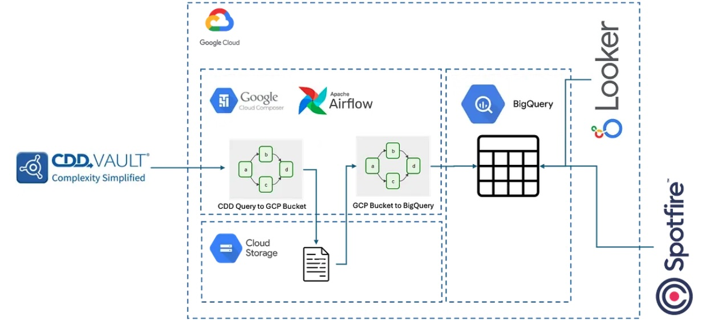

**Project Overview:**
The Serverless Data Platform is a cloud based data engineering solution built to unify scientific data from Egnyte, CDD Vault, and GCP. It automates ingestion, transformation, and analytics workflows using Airflow on Cloud Composer, enabling teams to transition away from manual file handling and toward standardized, reliable, and scalable data operations.

## Objectives

1. Build a serverless, automated platform to ingest and process scientific data from multiple sources.
2. Enable seamless integration between Egnyte, CDD Vault, and BigQuery for unified analytics and reporting.
3. Reduce manual scientist workflows by replacing CSV based processes with fully automated pipelines.
4. Provide a scalable architecture supporting new datasets, collaborators, and downstream tools.

## Background

The scientific organization relied heavily on manual data workflows, including performing transformations in spreadsheets, uploading files to multiple systems, and maintaining separate versions of key datasets. These processes caused inconsistent data quality, slow turnaround time, and limited visibility across teams. A cloud native solution was needed to standardize pipeline execution, centralize analytics, and eliminate operational bottlenecks.

## Problem

Data from CRO partners, experiments, and scientific systems existed across Egnyte, CDD Vault, and local file storage. Scientists manually merged and cleaned files, often leading to errors and outdated datasets. There was no unified pipeline framework, no automated transformations, and no consolidated analytical layer. The organization needed a modern, automated platform that could scale without dedicated DevOps support.

## Features

1. **Automated Data Pipelines**
   - Python based Airflow DAGs orchestrate extraction, transformation, and loading across all systems.
   - Modular pipelines separate extraction and transformation to simplify development and maintenance.

2. **Egnyte to CDD Vault Ingestion**
   - Automatically pulls CRO data from Egnyte.
   - Applies transformations and loads results into CDD Vault on a weekly schedule.

3. **CDD Vault to BigQuery Integration**
   - Extracts saved searches from CDD Vault.
   - Loads structured datasets into BigQuery for analytics.

4. **Unified Analytics Layer**
   - BigQuery datasets support dashboards in Spotfire, Looker, and Metabase.
   - Schema auto detection enables rapid onboarding of new scientific data types.

5. **Cloud Native Operational Management**
   - Cloud Composer handles Airflow reliability, alerting, scaling, and scheduling.
   - CI and CD workflows automate deployment of new pipelines and transformations.

## Technology Stack

- Orchestration: Cloud Composer and Apache Airflow  
- Cloud Platform: Google Cloud Platform  
- Storage and Analytics: BigQuery  
- Integrations: Egnyte Public API, CDD Vault API  
- Languages: Python  
- Downstream Tools: Spotfire, Looker, Metabase  

## Outcome

The Serverless Data Platform eliminated manual data handling and established a centralized, automated system for scientific data processing. It improved data reliability, accelerated reporting, and enabled cross functional teams to work from consistent, analysis ready datasets. The architecture now supports rapid expansion of new pipelines, data sources, and collaborators while maintaining low operational overhead.

## Details

📖 **Further Reading**  
For a deeper dive into the architecture and implementation, check out my Medium article:  
👉 [Building a Serverless Scientific Data Platform on GCP](https://medium.com/@pomara123/an-approach-to-a-serverless-data-platform-for-biotech-start-ups-0cd0138e9c16)
