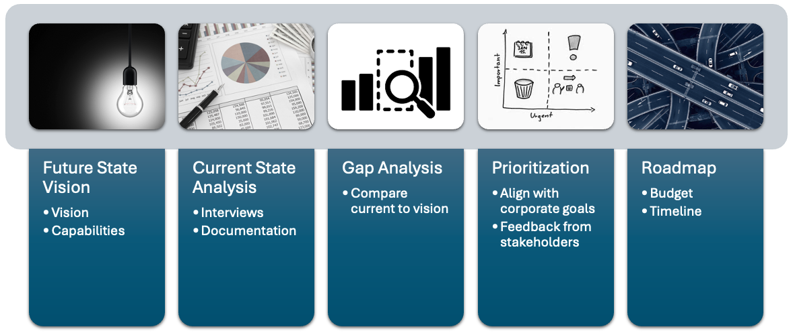
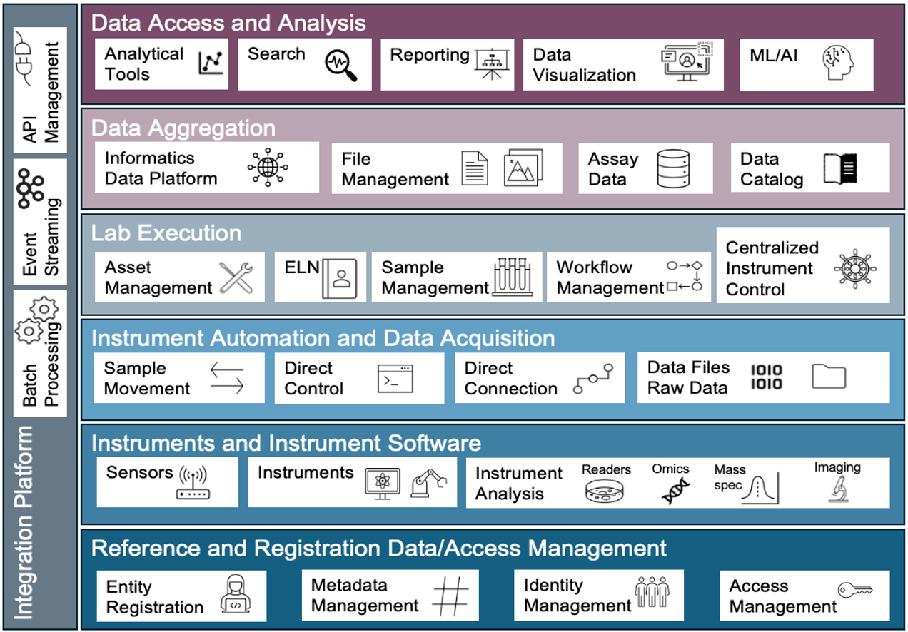

**Project Overview:**  
This project evaluated the current informatics landscape across research, biology, chemistry, proteomics, operations, and data science teams. The assessment identified process gaps, system limitations, data challenges, and opportunities to modernize the scientific digital ecosystem. The outcome provided a clear future state vision and a prioritized roadmap that strengthens data quality, improves workflow efficiency, and prepares the organization for increased AI and ML adoption.

## Objectives

1. Perform a cross functional analysis of scientific workflows, data sources, and system usage.  
2. Identify gaps in materials management, request management, data processing, analytics, asset management, and infrastructure.  
3. Establish a future state architecture that improves data integrity, scalability, and interoperability.  
4. Recommend actionable steps that align the organization with industry trends and modern informatics practices.

## Background

The organization relied on a mixture of spreadsheets, legacy processes, isolated systems, and ad hoc analysis tools. Assay tracking, compound management, proteomics workflows, and biological data handling varied across teams. Many groups generated or analyzed data on local computers, leading to inconsistencies and limited visibility. A centralized assessment was needed to clarify pain points and define an informatics strategy aligned with growing scientific demands.

## Problem

Teams required better systems for registration, sample tracking, request coordination, instrument data capture, analytics, and asset oversight. Data resided across CDD Vault, Egnyte, spreadsheets, local drives, and on-prem servers. Key limitations included lack of inventory tracking, no unified request management, inconsistent data normalization, limited cloud use, and fragmented ETL solutions. These gaps prevented scalable scientific operations and blocked future AI and ML initiatives.

<small>Visual representation of the gap analysis process.</small>

## Features

1. **Comprehensive Workflow Review**  
   - Conducted interviews across CADD, Biology/Biochemistry, Chemistry, Proteomics, and Ops.  
   - Documented data creation, maintenance, and analysis workflows.

2. **System and Capability Mapping**  
   - Evaluated use of CDD Vault, Egnyte, Spotfire, Data Warrior, PRISM, Pipeline Pilot, Knime, and Portal.  
   - Assessed instrument connectivity and data capture capabilities.

3. **Gap Identification**  
   - Highlighted needs in materials management, request systems, analytics centralization, and infrastructure modernization.  
   - Noted growing requirements for proteomics throughput, animal registration, and chemical inventory tracking.

4. **Future State Architecture**  
   - Designed a conceptual architecture covering registration, lab execution, data aggregation, analytics, integrations, and workflow management.  
   - Emphasized scalable cloud storage, unified pipelines, and structured data models.
   
   
   <small>Conceptual view of the future-state scientific informatics architecture.</small>

5. **Industry Alignment**  
   - Incorporated trends in AI, ML, digital twins, cloud computing, and modern data engineering practices.  
   - Positioned the organization to leverage data as a strategic asset.

## Technology Stack

- Core Platforms: CDD Vault, Egnyte  
- Analysis Tools: Spotfire, Data Warrior, PRISM  
- ETL Tools: Pipeline Pilot, Knime, Portal  
- Infrastructure: On-prem servers, planned NAS expansion, limited cloud adoption  
- Integrations: Instrument data flows, CRO data, scientific workflows  
- Emerging Needs: Cloud storage, unified analytics, automated pipeline frameworks  

## Outcome

The assessment delivered a consolidated view of the organization’s scientific digital landscape along with a prioritized set of opportunities for improvement. The resulting roadmap outlined changes needed in data registration, assay workflows, inventory tracking, request management, data aggregation, and analytics. The future state strategy positions the organization for modern scalable informatics practices and provides a strong foundation for AI and ML adoption.

