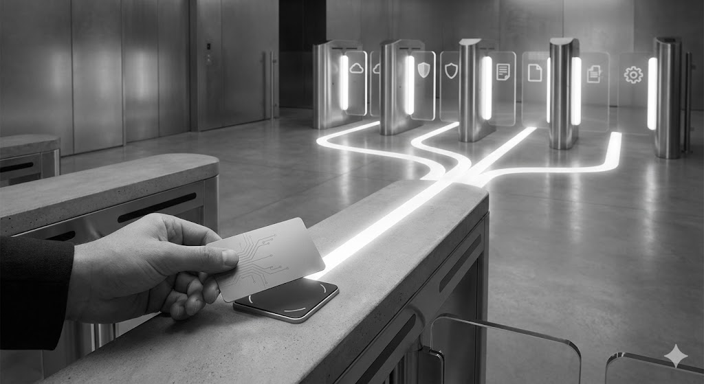

**Project Overview:**
This project involved implementing a robust Single Sign-On (SSO) solution across multiple internal applications to provide seamless authentication for users. The SSO system reduced password fatigue, improved security posture, and enabled centralized management of user identities and access policies.

## Objectives

1. Enable a single login experience across all internal applications.
2. Strengthen security using centralized authentication and role-based access controls.
3. Reduce IT support overhead for password resets and account management.
4. Integrate the SSO solution with existing user directories and identity providers.

## Background

The organization had multiple internal applications, each requiring separate login credentials. This created friction for users, increased password-related support tickets, and presented security challenges in managing user access consistently. A centralized SSO solution was needed to improve user experience and security governance.

## Problem

Users struggled with remembering multiple credentials and often resorted to insecure practices like password reuse. The IT team faced high volumes of password reset requests and difficulty enforcing consistent access policies. There was also limited visibility into who had access to which applications.

## Features

1. **Centralized Authentication**
   - Users authenticate once and gain access to all connected applications.
   - Supports standard protocols such as SAML, OAuth 2.0, and OpenID Connect.

2. **Integration with Identity Providers**
   - Connects to Active Directory and other existing identity management systems.
   - Ensures accurate user provisioning and de-provisioning.

3. **Role-Based Access Control**
   - Grants access to applications and resources based on user roles.
   - Simplifies onboarding and offboarding processes.

4. **Enhanced Security**
   - Multi-factor authentication (MFA) enforced for sensitive applications.
   - Centralized logging and monitoring for compliance and auditing.

5. **Improved User Experience**
   - Seamless login across multiple systems reduces password fatigue.
   - Self-service options for password resets and profile management.

## Technology Stack

- SSO Platform: Okta / Azure AD (or specify your solution)  
- Protocols: SAML, OAuth 2.0, OpenID Connect  
- Directory: Active Directory / LDAP  

## Outcome

The SSO implementation streamlined authentication, reducing password-related friction and support requests. It strengthened security through centralized access control, auditing, and role-based permissions, while simplifying onboarding, offboarding, and overall user management across multiple applications, enhancing operational efficiency and governance.
